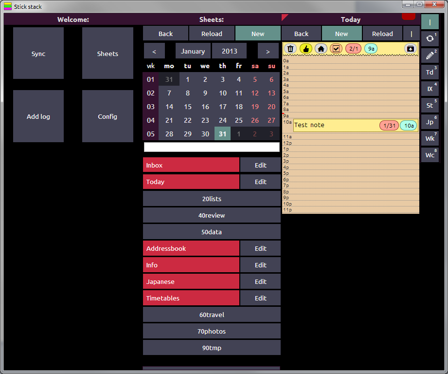

## StickStack - Sticky notes taking application powered by Lima1

### Main features
* First POC for Lima1 project
* Built with JavaScript, Phonegap, jquery, Adobe AIR, Crome Web applications
* Universal UI: depending of window/screen size, different number of UI columns is dynamically displayed
* Android application with Phonegap with tablet support
* Keyboard support
* Other features
  * Web font for icons
  * Static google maps library for Checkins and paths
  * Adobe AIR multiwindow feature and third-party apps support via command line
* Not maintained anymore

### Screenshots

